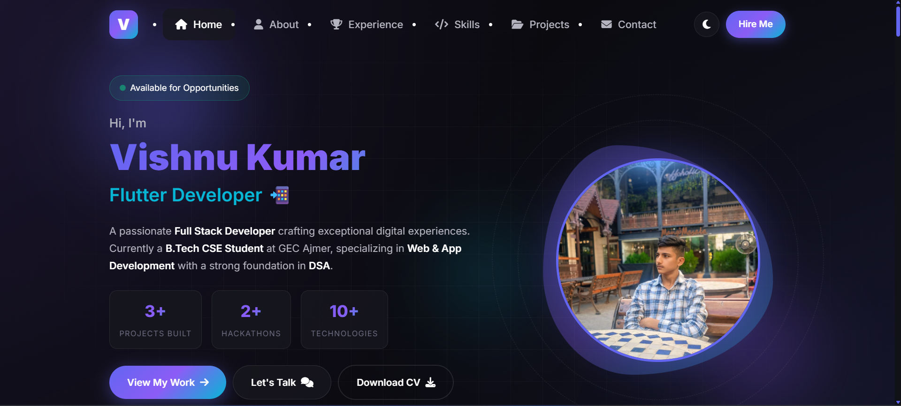
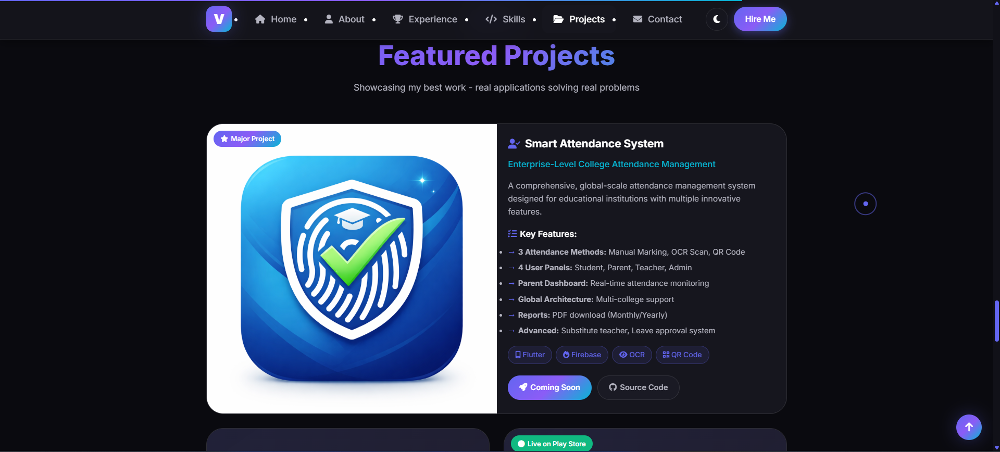
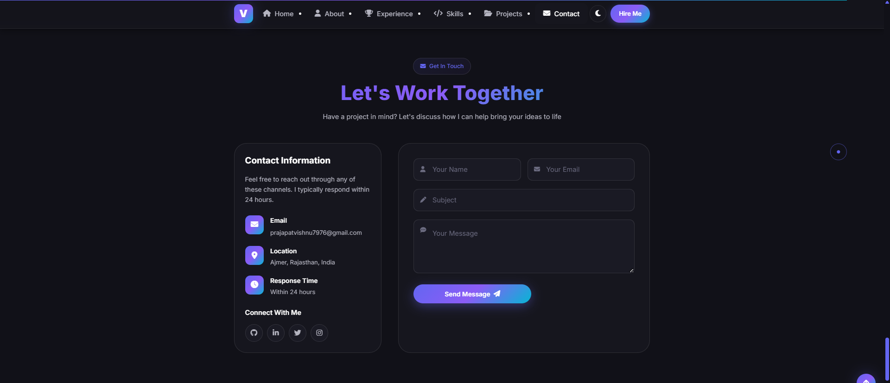

# 🚀 Vishnu Kumar | Full Stack Developer Portfolio

<div align="center">
  
  
  
  
  
  
  <h3>Full Stack Developer (Web + App) | Problem Solver | Tech Enthusiast</h3>
  
  <p>
    <a href="https://prajapatvishnu7976-sys.github.io/Vishnu-portfolio/" target="_blank">
      
    </a>
    <a href="https://linkedin.com/in/vishnu-kumar-545037327" target="_blank">
      
    </a>
    <a href="mailto:prajapatvishnu7976@gmail.com">
      
    </a>
  </p>
</div>

---

## 🎯 About Me

I'm a passionate **Full Stack Developer** currently pursuing **B.Tech in Computer Science Engineering** at Government Engineering College, Ajmer (2024-2028). I specialize in building modern web and mobile applications that solve real-world problems.

- 🔭 Currently working on **Smart Attendance System** (Major Project)
- 🌱 Learning **Advanced Flutter** and **Node.js**
- 👯 Looking to collaborate on **Open Source Projects**
- 💬 Ask me about **React, Flutter, Firebase, or DSA**
- ⚡ Fun fact: I love participating in Hackathons!

---

## ✨ Features

- 🌓 **Dark/Light Mode** - Toggle between themes
- 📱 **Fully Responsive** - Works on all devices (Mobile, Tablet, Desktop)
- ⚡ **Smooth Animations** - Scroll animations and transitions
- 🎨 **Modern UI/UX** - Glassmorphism design with gradient effects
- 📧 **Working Contact Form** - Integrated with Web3Forms
- 🖱️ **Custom Cursor** - Interactive cursor effects (Desktop)
- ⚡ **Fast Loading** - Optimized for performance

---

## 🛠️ Tech Stack

### Frontend


### Backend & Database


### Mobile Development


### Programming Languages


### Tools & Technologies


---

## 📂 Projects Showcase

### 1. 🎓 Smart Attendance System (Major Project)
**Enterprise-Level College Attendance Management**
- **Tech:** Flutter, Firebase, OCR, QR Code
- **Features:** 3 Attendance Methods (Manual, OCR, QR), 4 User Panels (Student, Parent, Teacher, Admin), Real-time monitoring, PDF Reports
- **Status:** 🚧 In Progress
- [View Code](https://github.com/prajapatvishnu7976-sys/smart-attendance-app)

### 2. 💻 Code Logic
**Complete DSA Learning & Practice Platform**
- **Tech:** Flutter, Firebase
- **Features:** DSA Problem Solver, Learning Roadmap, Daily Challenges with Leaderboard, Job Preparation
- **Status:** ✅ Live on Play Store
- [View App](https://play.google.com/store/apps/details?id=com.vishnu.codelogic) | [View Code](https://github.com/prajapatvishnu7976-sys/code_logic)

### 3. 🏛️ My Yojna
**Smart Government Scholarship Finder**
- **Tech:** Java, Android, Firebase
- **Features:** Smart Filtering, Eligibility Check, Notifications, Direct Application Links
- **Status:** ✅ Live on Play Store (10K+ Downloads)
- [View App](https://play.google.com/store/apps/details?id=com.praja.schemesapp&hl=hi)

---

## 🏆 Achievements

- 🥇 **2x Hackathon Participant** (Suresh Gyan University & Shankara Global University)
- 📜 **WordPress Certification** - Participation Certificate
- 📱 **Published App Developer** - My Yojna on Google Play Store
- 🌟 **500+ Connections** on LinkedIn
- 💻 **3+ Production Ready Projects** Built

---

## 📸 Screenshots

<div align="center">
  
  
  
</div>

> 📝 **Note:** Add your screenshots in a `screenshots` folder and update the paths above.

---

## 🚀 Live Demo

**🌐 Website URL:** [https://prajapatvishnu7976-sys.github.io/My-portfolio/](https://prajapatvishnu7976-sys.github.io/My-portfolio/)

**⚡ Performance Score:**
- Desktop: 95+ / 100
- Mobile: 90+ / 100
- SEO Optimized ✅
- Accessibility Friendly ♿

---

## 🛠️ Installation & Setup

Want to run this portfolio locally? Follow these steps:

```bash
# Clone the repository
git clone https://github.com/prajapatvishnu7976-sys/my-portfolio.git

# Navigate to the directory
cd Vishnu-portfolio

# Open with Live Server (VS Code extension)
# Or simply open index.html in your browser
